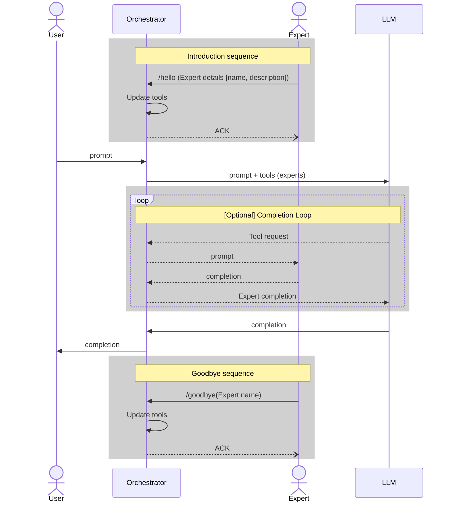

# yaap - Yet Another Agent Protocol

Yet Another Agent Protocol (YAAP) is a protocol that enables the dynamic addition and removal of experts to a Multi-Agent system.

With YAAP, it is possible to add expertise to an existing system without needing to re-deploy infrastructure.

This gives the user experience of evolving knowledge as the chat is made smarter & more useful over time as more experts are deployed.

## Inspiration & Evolution

- Could Experts (aka Agents) be added to an LLM conversation like a chat room?
- Started with a SignalR implementation, loosely based on [the SignalR Chat Room sample](https://learn.microsoft.com/en-us/azure/azure-signalr/signalr-quickstart-dotnet-core)
- Evolved into gRPC, then WebSockets, finally Model Context Protocol (MCP)

## Protocol Basics

1. Users interact with an Orchestrator via `/chat` entrypoint which offers LLM completions
1. Orchestrator also exposes hello and goodbye functionality
    - `hello` – used by Experts to introduce themselves with a name and a description
        - Orchestrator then adds the Expert to the list of Tools given to the underlying LLM, using the name and description given by the Expert during this call
    - `goodbye` – used by Experts to remove themselves from considering by the Orchestrator (e.g., during Shutdown)
        - Removed from Orchestrator’s Tools collection
1. Implementations vary based on the underlying protocol, for example:
    - SignalR – Hub directs Hello and Goodbye messages to connected Orchestrator
    - gRPC – mapped as a protocol definition to a handler
    - WebSockets – payload has `action` and `detail`
        - `action` = `hello`
        - `detail` = Agent definition
    - MCP – Experts introduce to the MCP server, updates ToolList, notifies Orchestrator

YAAP is built on top of the OpenAI concept of [LLM Function Calling](https://platform.openai.com/docs/guides/function-calling?api-mode=responses), which allows the LLM to call functions (or tools) that are registered with it. This allows the LLM to use the tools to perform actions or retrieve information that it may not have access to directly. In the context of YAAP, the tools are the experts that are registered with the Orchestrator.

In YAAP, however, there is a sequence prepended and included in the context of the overall system, the Introduction.

When each Expert comes online, it must Introduce itself to the Orchestrator. This is done by sending a message to the Orchestrator, which includes the Expert's name and description. The Orchestrator then updates its list of tools (experts) and sends an ACK back to the Expert.

When a User sends a chat completion request to the Orchestrator, the Orchestrator sends the User's prompt along with the list of tools (experts) to the LLM. The LLM then generates a response based on the User's prompt and the available tools.

Explore the [samples](samples/README.md) area of this repo for example implementations of YAAP using different protocols.
