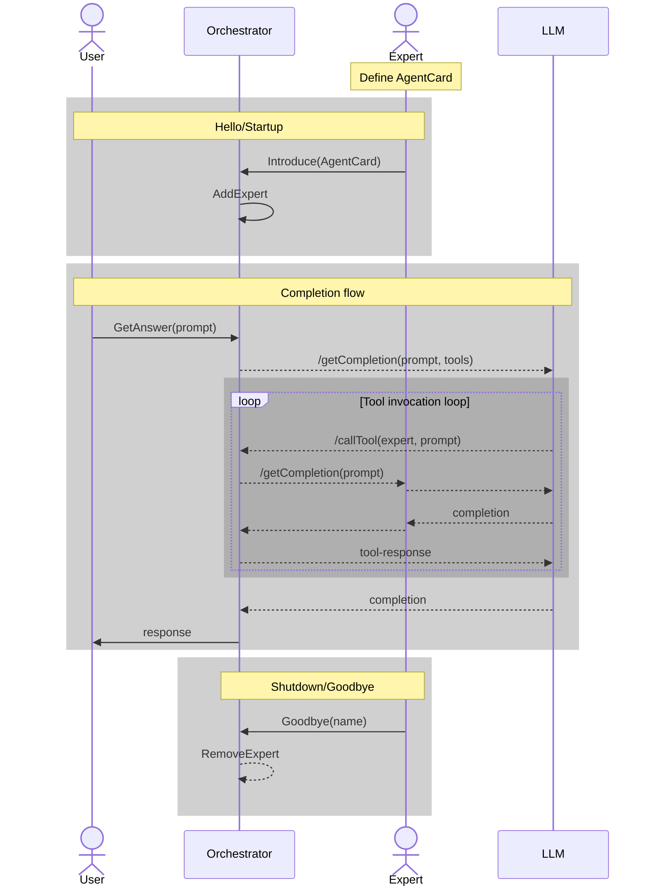

# A2A with YAAP

Google's A2A (Agent to Agent) is a concept where one agent can call another agent to perform tasks. This is useful when you want to delegate specific tasks to specialized agents.

The primary add that A2A offers in YAAP is the `AgentCard` model. This model effectively replaces the `YaapClientDetail` construct. Since A2A is simply a JSON RPC schema, you can couple it with any number of transport layers.

However, unlike YAAP, A2A does not provide the concept of introduction. So, we merge the two ideas introduce the agent to the orchestrator by sending A2A's `AgentCard` and utilize `a2a-net`'s client construct to make calls back to the agent from within a Semantic Kernel function.

To illustrate just how _not_ coupled to a protocol either of these are, we actually introduce using WebSockets, and invoke using straight HTTP.

