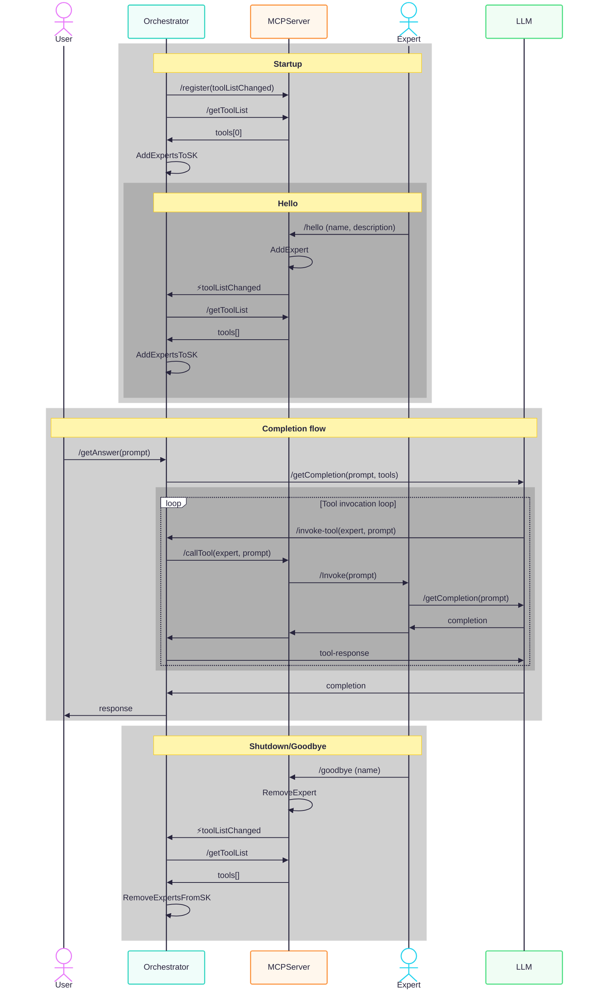

```mermaid

---
config:
  theme: redux-color
  look: handDrawn
---
sequenceDiagram
    actor U as User
    participant O as Orchestrator
    participant S as MCPServer
    actor E as Expert
    participant L as LLM
    
rect rgba(100,100,100,.3)
    Note over O,E: Startup   
    O->>S: /register(toolListChanged)
    O->>S: /getToolList
    S->>O: tools[0]
    O->>O: AddExpertsToSK
    rect rgba(100,100,100,.3)
        Note over O,E: Hello
        E->>S: /hello (name, description)
        S->>S: AddExpert
        S->>O: ⚡toolListChanged
        O->>S: /getToolList
        S->>O: tools[]
        O->>O: AddExpertsToSK
    end
end
rect rgba(100,100,100,.3)
    Note over U,L: Completion flow
    U->>O: /getAnswer(prompt)
    O->>L: /getCompletion(prompt, tools)

    rect rgba(100,100,100,.3)
        loop Tool invocation loop
            L->>O: /invoke-tool(expert, prompt)
            O->>S: /callTool(expert, prompt)
            S->>E: /Invoke(prompt)
            E->>L: /getCompletion(prompt)
            L->>E: completion
            E->>S:  
            S->>O:  
            O->>L: tool-response
        end
    end

    L->>O: completion
    O->>U: response
end
rect rgba(100,100,100,.3)
 note over E,O: Shutdown/Goodbye
    E->>S: /goodbye (name)
    S->>S: RemoveExpert
    S->>O: ⚡toolListChanged
    O->>S: /getToolList
    S->>O: tools[]
    O->>O: RemoveExpertsFromSK
end

```
