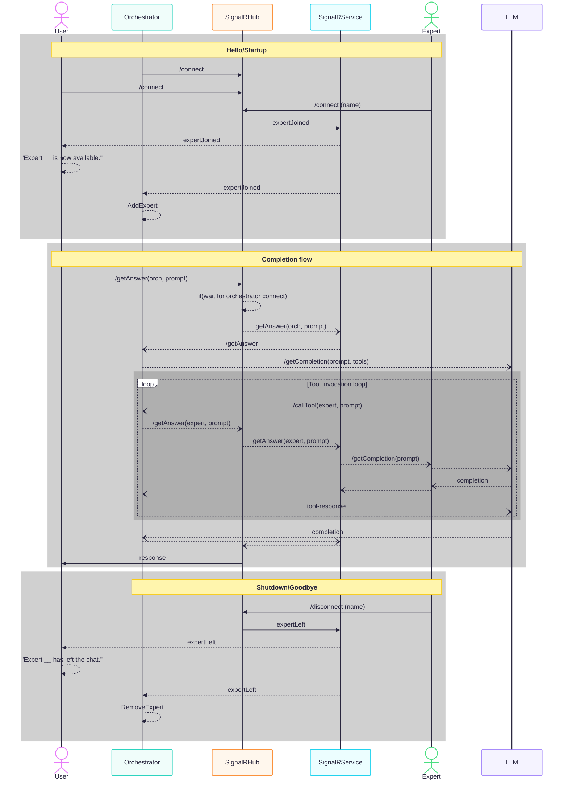

```mermaid

---
config:
  theme: redux-color
  look: handDrawn
---
sequenceDiagram
    actor U as User
    participant O as Orchestrator
    participant H as SignalRHub
    participant S as SignalRService
    actor E as Expert
    participant L as LLM
    
rect rgba(100,100,100,.3)
    Note over U,E: Hello/Startup   
    O->>H: /connect
    U->>H: /connect
    E->>H: /connect (name)
    H->>S: expertJoined
    S-->>U: expertJoined
    U-->>U: "Expert __ is now available."
    S-->>O: expertJoined
    O-->>O: AddExpert
end
rect rgba(100,100,100,.3)
    Note over U,L: Completion flow
    U->>H: /getAnswer(orch, prompt)
    H-->>H: if(wait for orchestrator connect)
    H--)S: getAnswer(orch, prompt)
    S--)O: /getAnswer
    O--)L: /getCompletion(prompt, tools)

    rect rgba(100,100,100,.3)
        loop Tool invocation loop
            L--)O: /callTool(expert, prompt)
            O--)H: /getAnswer(expert, prompt)
            H--)S: getAnswer(expert, prompt)
            S--)E: /getCompletion(prompt)
            E--)L: 
            L--)E: completion
            E--)S: 
            S--)O: 
            O--)L: tool-response
        end
    end

    L--)O: completion
    O--)S: 
    S--)H: 
    H->>U: response
end
rect rgba(100,100,100,.3)
 note over E,O: Shutdown/Goodbye
    E->>H: /disconnect (name)
    H->>S: expertLeft
    S-->>U: expertLeft
    U-->>U: "Expert __ has left the chat."
    S-->>O: expertLeft
    O-->>O: RemoveExpert
end

```
