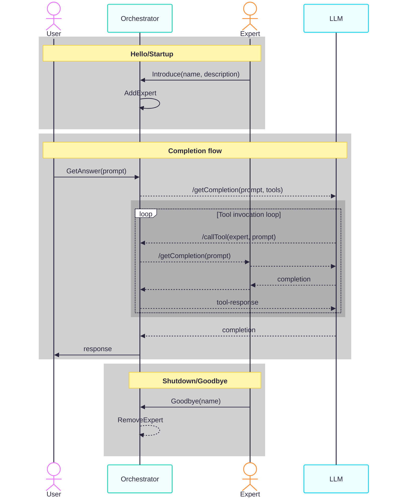

```mermaid

---
config:
  theme: redux-color
  look: handDrawn
---
sequenceDiagram
    actor U as User
    participant O as Orchestrator
    actor E as Expert
    participant L as LLM
    
rect rgba(100,100,100,.3)
    Note over U,E: Hello/Startup   
    E->>O: Introduce(name, description)
    O->>O: AddExpert
end
rect rgba(100,100,100,.3)
    Note over U,L: Completion flow
    U->>O: GetAnswer(prompt)
    O-->>L: /getCompletion(prompt, tools)

    rect rgba(100,100,100,.3)
        loop Tool invocation loop
            L-->>O: /callTool(expert, prompt)
            O-->>E: /getCompletion(prompt)
            E-->>L: 
            L-->>E: completion
            E-->>O: 
            O-->>L: tool-response
        end
    end

    L-->>O: completion
    O->>U: response
end
rect rgba(100,100,100,.3)
 note over E,O: Shutdown/Goodbye
    E->>O: Goodbye(name)
    O-->>O: RemoveExpert
end

```
